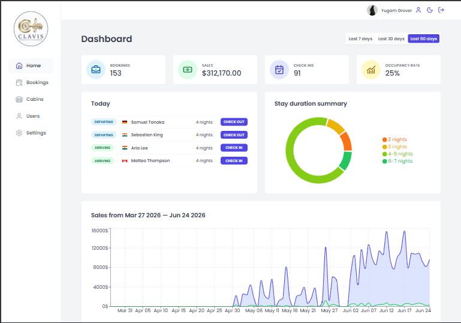
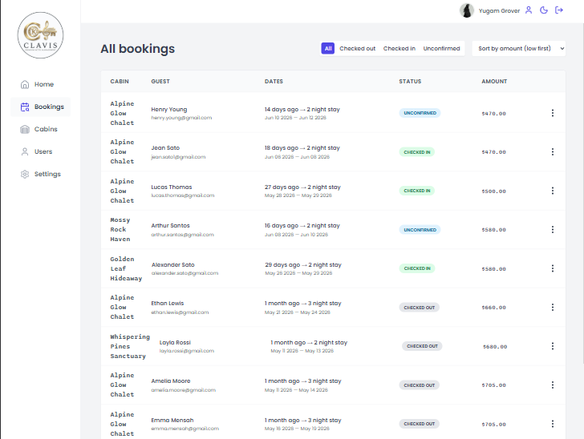
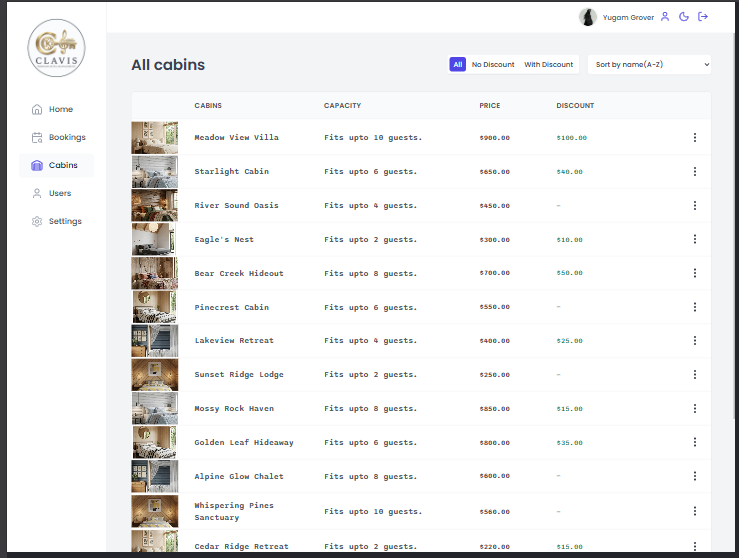
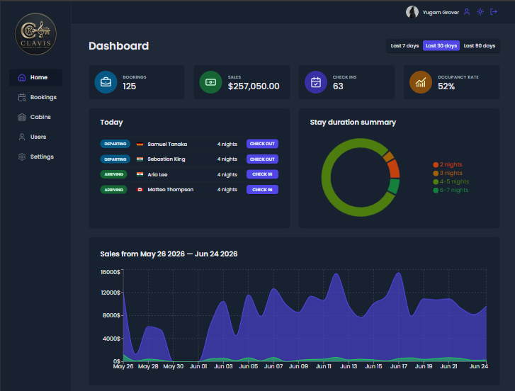

# Clavis — Hotel Management Dashboard

A full-stack hotel operations dashboard for managing bookings, cabins, check-ins, and sales analytics.

[](https://clavis-dashboard.vercel.app/)
[](https://github.com/Yugam-Grover/Hotel-Dashboard)

---

## Preview

| Dashboard | Bookings |
|---|---|
|  |  |

| Cabin Management | Dark Mode |
|---|---|
|  |  |

---

## Demo Access

No sign-up required. The demo is pre-loaded with sample data.

> **Email:** `YOUR_DEMO_EMAIL`  
> **Password:** `YOUR_DEMO_PASSWORD`

Hit **Login** and explore the full dashboard.

---

## Features

- **Analytics Dashboard** — Sales revenue, occupancy rates, and booking trends visualized with Recharts across user-selected date ranges
- **Bookings** — Full booking management with server-side filtering, sorting, and paginated navigation
- **Cabins** — Create, edit, and delete cabin listings with image upload to Supabase Storage
- **Check-in / Check-out** — Manage guest arrivals and departures with status tracking
- **User Settings** — Update profile details, avatar, and global hotel configuration
- **Dark Mode** — Full dark/light theme toggle applied globally across the interface

---

## Tech Stack

| Layer | Technology |
|---|---|
| Framework | React, Vite |
| Styling | Styled Components, CSS Custom Properties |
| Remote State | TanStack Query |
| Forms | React Hook Form |
| Charts | Recharts |
| Backend | Supabase — Auth, PostgreSQL, Storage |
| Error Handling | React Error Boundaries |
| Performance | React.lazy, Suspense |

---

## Technical Highlights

### Supabase as a Backend-as-a-Service

All backend concerns — JWT authentication, PostgreSQL database operations, and cabin image file storage — are handled through Supabase. This eliminates a custom Node/Express server while still providing a fully relational database. Row Level Security (RLS) policies on the database ensure users can only access their own data, enforced at the database level rather than the application layer.

---

### TanStack Query with Pagination Prefetching

Remote state for bookings and cabin records is managed with TanStack Query. Filtering, sorting, and pagination happen at the database level — not in the browser. The next page's data is prefetched while the user is still on the current page, so table navigation feels instant with no loading state on transition.

---

### Compound Component Pattern

`Modal`, `Table`, and `Form` are built using the compound component pattern. Each parent manages its own internal state via React Context and exposes child components that consume it — no prop threading between parent and children.

```jsx
<Modal>
  <Modal.Open opens="edit-cabin">
    <Button>Edit</Button>
  </Modal.Open>
  <Modal.Window name="edit-cabin">
    <EditCabinForm />
  </Modal.Window>
</Modal>
```

This keeps the consumer API clean and the internal state management fully encapsulated.

---

### Performance — Lighthouse 74 → 90

Route-based code splitting with `React.lazy` and `Suspense` splits the bundle into per-route chunks — the browser downloads only the JavaScript for the current page on first load. Each route is also wrapped in an `ErrorBoundary` so a failure on one page doesn't affect the rest of the dashboard.

---

### Dark Mode via CSS Custom Properties

Theme switching is handled entirely through CSS custom properties on the `:root` element. Toggling the theme swaps a set of variable values — `--color-brand-50`, `--backdrop`, `--shadow-md`, etc. — and every styled component updates automatically. No JavaScript-driven style injection, no Context re-renders triggered by theme state.
